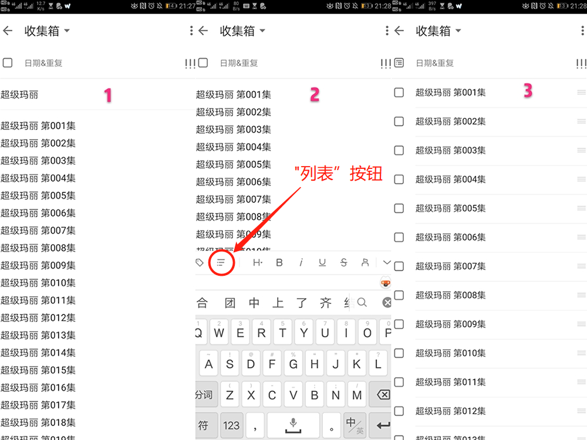

# batch_tasks_generator4dida365

## 介绍
一个用于滴答清单批量任务生成的Python脚本，主要针对书籍、课程、电影和电视剧等多章节内容的，利用滴答清单邮箱生成任务，并包含“任务名+序号”形式的子任务。


## 安装教程
1.  在*dida365_tasklist.py*中填写自己的邮箱地址，及其stmp服务器的账户、密码和地址，作为发送；（相关信息可以查看相应电子邮箱的stmp帮助）
2.  在*dida365_tasklist.py*中填写滴答清单的邮箱地址，作为接收方。

3. 在*dida365_tasklist.py*修改如下代码，自定义标题和内容的字符串生成格式

    

## 使用说明

1.  在*dida365_tasklist.py*同目录下新建或修改*input.txt*，每一行表示一个任务，采用逗号间隔的格式化串编写，其中逗号为英文逗号，日期格式需要符合滴答清单智能识别规则;

    -   **<任务名>** 
    -   **<任务名>,,<日期>** 
    -   **<任务名>,<子任务数>**
    -   **<任务名>,<子任务数>,<日期>** 

    ```markdown
    三国演义
    魂斗罗,,明天
    西游记,100
    超级玛丽,5,明天
    ```

2.  在*dida365_tasklist.py*目录启动命令行，并执行该Python脚本;

    ```powershell
    python3 dida365_tasklist.py
    ```

3.  在滴答清单的客户端内修改任务属性，触发“描述”和“列表”的切换。

    